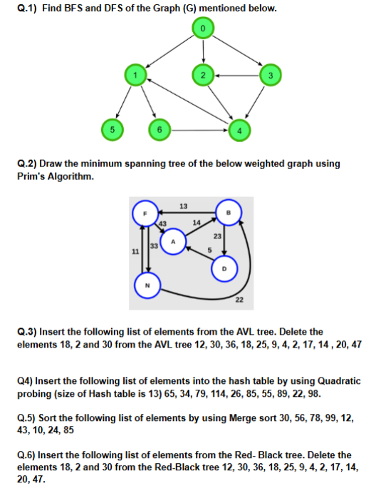

# ASSIGNMENT 01
> - Attempt any 6 questions, but Questions 5, 7, 8, and 9 are mandatory.
> - Use A4 paper only.
> - Use this as a Frontpage. 
 <a href="/DATA-STRUCTURE/AT.pdf" target="_blank">Click here to download Frontpage</a> .

## Questions:

1. Explain doubly linked list operations in detail.
2. Devise an algorithm for following operations of Single Linked List.
   - a. Insert a new node before a node
   - b. Delete Last node
3. Explain how to create circular linked list and insert nodes at end ? 
4. Explain the operations simple Queue
5. Covent the following Infix Expression to Postfix Expression
   - `((3*4)/5+3*2-6*2)`
   - `A + (B * C) - ((D * E + F) / G)`
6. Explain the procedure to evaluate postfix expression and evaluate the following expression `6 2 3 + - 3 8 2 / + * 2 % 3 +`
7. Explain binary search tree. Creat a BST for the following values 
 - `56,30,40,50,69,77,80,90,20,10` 
 - `Q,E,C,I,J,T,W,Z,X`
8. Explain AVL tree with an example. Explain all types of rotation in AVL tree with an Example ?
9. Explain B tree with an example. Construct a B-Tree of order 5 by inserting the keys: 11, 25, 55, 15, 60, 30, 80, 19, 27.

<!-- # ASSIGNMENT 02

> - Write any 5 questions from the list below. However, Question 6 is mandatory.
> - Use A4 paper only.
> - Use this as a Frontpage. 
 <a href="/DATA-STRUCTURE/AT2.pdf" target="_blank">Click here to download Frontpage</a> .

 -->

<!--
# ASSIGNMENT 01
> - Write any 5 Questions from below .
> - Use A4 paper only.
> - Use this as a Frontpage. 
 <a href="/DATA-STRUCTURE/AT.pdf" target="_blank">Click here to download Frontpage</a> .

## Questions:

1. Explain Performance Analysis in detail with examples.
2. Explain doubly linked list operations in detail.
3. Devise an algorithm for following operations of Single Linked List.
   - a. Insert a new node before a node
   - b. Delete Last node
4. Differentiate between Linear and non-linear data structures.
5. Explain the operations simple Queue
6. Covent the following Infix Expression to Postfix Expression
   - `((3*4)/5+3*2-6*2)`
   - `A + (B * C) - ((D * E + F) / G)`
7. Explain the procedure to evaluate postfix expression and evaluate the following expression `6 2 3 + - 3 8 2 / + * 2 % 3 +`
8. Differentiate between Linear and non-linear data structures.
9. Explain circular linked list operations in detail.
10. Explain DEQUE ?
11. Write a C program to implement the operations of Stack using array.
12. Explain the procedure to convert Infix to postfix ?
13. Explain how to create circular linked list and insert nodes at end ? 
14. Explain the time and space complexity of an
 algorithm with suitable example?
15. Write a program to implement the queue using linked list ?

 # ASSIGNMENT 02 -->
