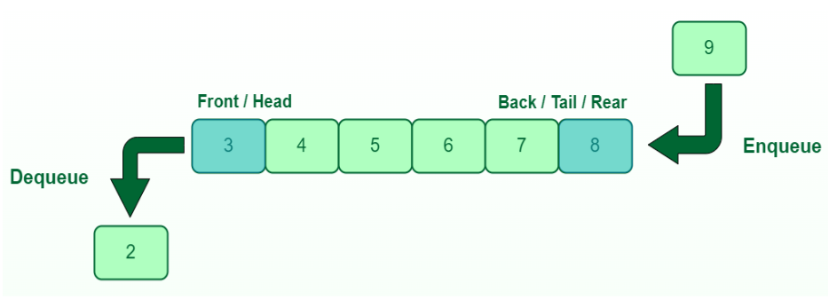

# QUEUE

- A queue is a linear data structure that stores items in First In First Out (FIFO) order.
- It is also known as a First Come, First Serve (FCFS).
- It is opened at both the ends (Rear and Front Ends).
- The elements can be inserted at the rear end and deleted from the front end.
- Queue maintains two variables Front and Rear. Initial value of Front and Rear are -1.

**Basic operations performed on queue are:**

1. Insertion-Inserts the element at rear end of the queue .
2. Deletion- deletes the element from front end of the queue.

**Implementation of queue:**

- Array Implementation of queue
- Linked List Implementation of queue
